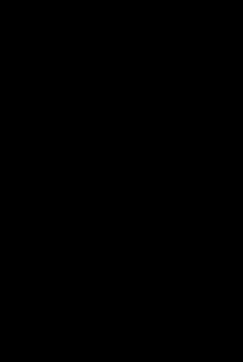
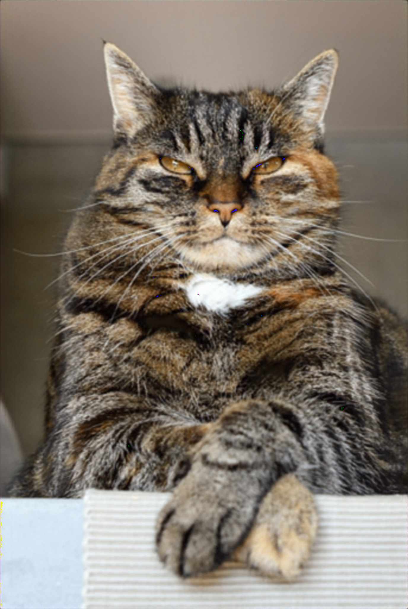

# DIP_Pytorch
Deep Image Prior for Image Super-Resolution

## Results (X4 SR)
| Input | Output | Training
 | ----- | ------ | --------
 | |  |

## Acknowledgements
- [DIP](https://github.com/DmitryUlyanov/deep-image-prior)
- [DIP](https://github.com/atiyo/deep_image_prior)
